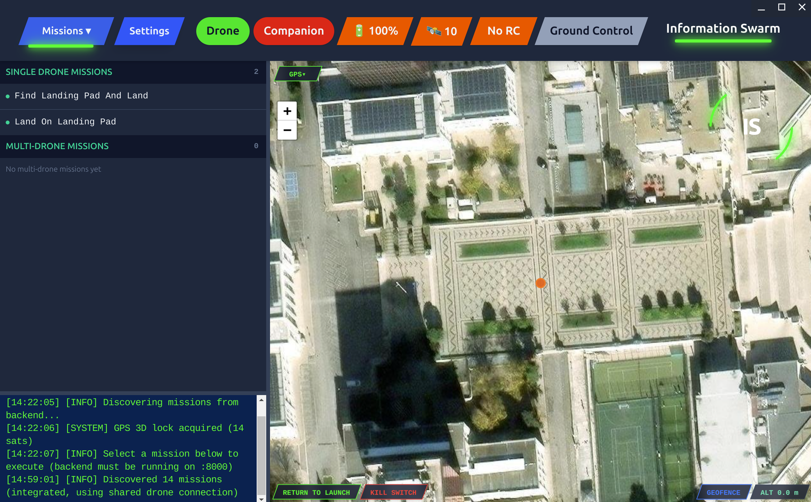

# Grant Welch

I build ground-control and companion software for PX4 aircraft.

## Information Swarm

A ground control station for end-to-end command of PX4 drone systems.

The screenshot is the Missions view: map, mission list, console, and return-to-launch / kill-switch.

- One station for missions, offboard and pilot-control modes, live telemetry, and vision
- Companion software on the aircraft (Jetson) so autonomy is not stuck to a laptop
- Safety layer: heartbeat watchdog, RTL if the app dies, geofence, clean airborne shutdown
- Same stack in Pegasus / Isaac Sim — live movements get a sim pass first
- Computer-vision landing: downward camera to find a pad and stay on target during descent

The source is private. I can walk through the code in an interview.

**Stack:** Electron + Vue on the laptop, FastAPI + MAVSDK on the backend, companion on Jetson, MAVLink radio, Isaac Sim / Pegasus for rehearsal.
